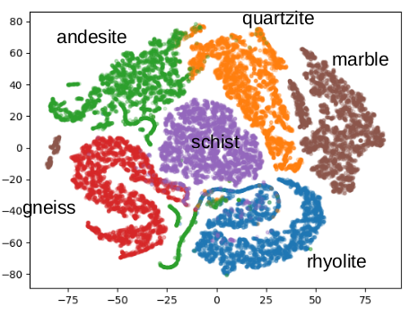
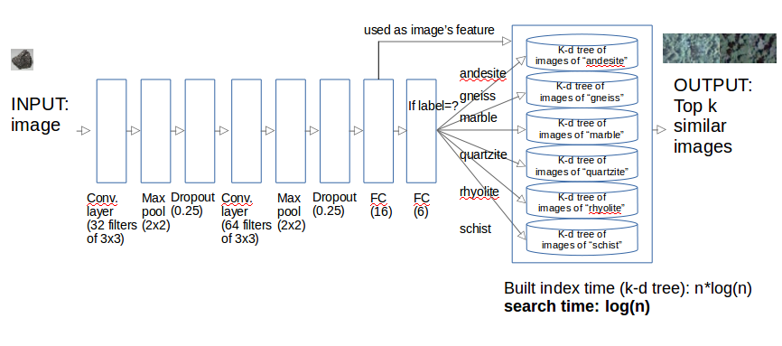
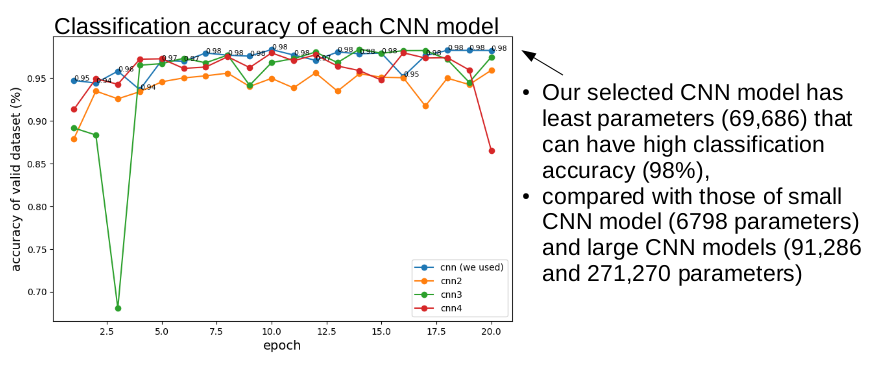
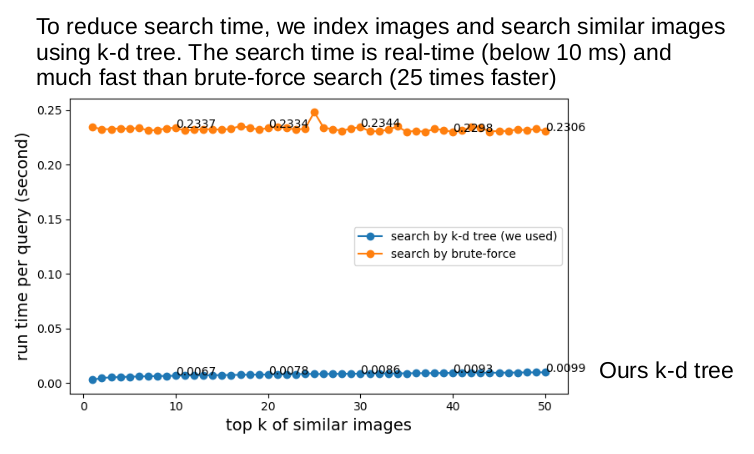
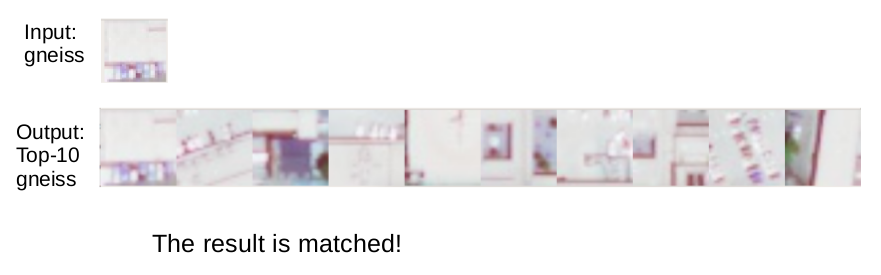
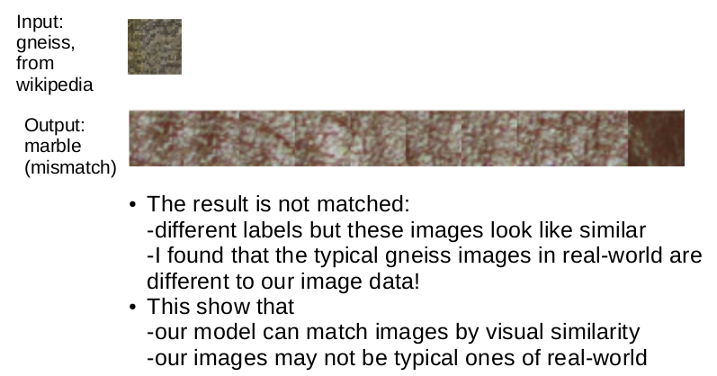

# Image Search by CNN Model and K-D Tree

Search similar images. \
The similarity between images are modeled by CNN (Convolutional Neural Networks) model. \
Real-time search by K-D Tree.

### Executing
Please refer to code/readme.txt for running

## Visulaization of Images
Images are plotted by feature values

## Search System (CNN model + K-D tree)

Input image and return top-k similar images

**Image similarity by features of CNN model** \
Each image is represented by feature values of the-sencond-to-last FC layer \
(the last FC layer outputs labels)

**Index by K-D tree** \
Each image is indexed by its feature values by K-D tree. \
Build index: n*log(n) \
***Search: log(n)***

## CNN Models Optimization

## Real-time Search by K-D tree

## Case study
**Matched case**

**Not matched case** \
To search for more types of images, we should use more different and new images to train models.

